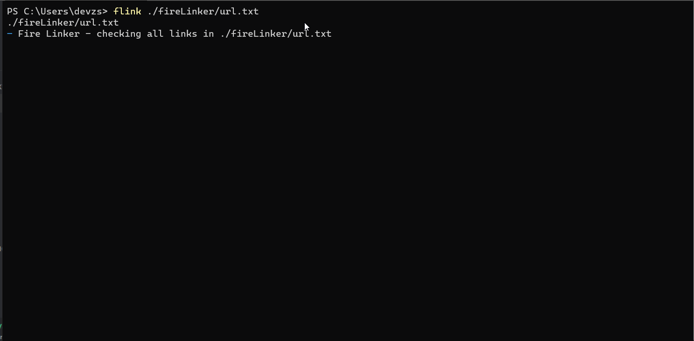

<h1 align="center">Welcome to Fire Linker 👋</h1>
<p>
  
  <a href="#" target="_blank">
    
  </a>
</p>

> A CLI tool that searches documents for the status of URLs/Links

## Install

```sh
npm i -g firelinker
```

## Usage

```sh
flink <FILE>
```

## Demo



## Features

### Status codes Supported

  <ul>
  <li>200</li> 
  <li>400 </li>
  <li>404</li>
  <li>410</li>
  </ul>

### URL Protocols Supported

  <ul>
  <li>HTTP</li> 
  <li>HTTPS</li>
  </ul>

### Colors Supported

- <p style="color:green">Green = GOOD URL</p>
- <p style="color:red">Red = BAD URL</p>
- <p style="color:grey">Grey =  UNKOWN URL</p>

### Commands Supported

```
To use this tool type :
    $flink <file> -- where file is the name of the file

    Options:
      -j, --json     output to json
      -a, --api      Check all links in API
      -h, --help     Show help                                             [boolean]
      -v, --version  Show version number                                   [boolean]
```

### API Support

needs to have a url attribute
Usage

```sh
$ flink -a http://localhost:3000/posts
Link: http://localhost:3000/posts/af9597b1f6 status : GOOD
Link: http://localhost:3000/posts/1270baa03e status : GOOD
Link: http://localhost:3000/posts/bafac59742 status : GOOD
Link: http://localhost:3000/posts/30b2a49c48 status : GOOD
Link: http://localhost:3000/posts/e6289c2fc1 status : GOOD
Link: http://localhost:3000/posts/e8e8e890e1 status : GOOD
Link: http://localhost:3000/posts/286248fb83 status : GOOD
Link: http://localhost:3000/posts/f4a6d1cc89 status : GOOD
Link: http://localhost:3000/posts/58fe66af20 status : GOOD
Link: http://localhost:3000/posts/f2951948eb status : GOOD
Fire Linker took 0 secs to check 10 links.
```

## Author

👤 **Devansh Shah**

- Github: [@zg3d](https://github.com/zg3d)

## Show your support

Give a ⭐️ if this project helped you!
